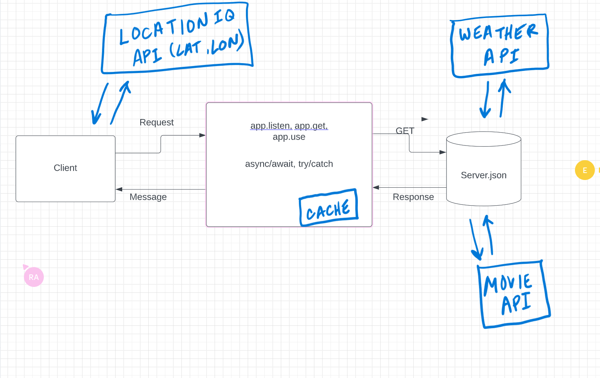

23mar23 
move on from previous labs

# City Explorer API

**Author**: laurence
**Version**: 1.0.0 (increment the patch/fix version number if you make more commits past your first submission)

## Overview
Server side

## Getting Started
npm init, touch server.js, npm install express, npm install -g nodemon, npm install dotenv, npm install cors

## Architecture
Using data.json as API for now

## Change Log
<!-- Use this area to document the iterative changes made to your application as each feature is successfully implemented. Use time stamps. Here's an example:

01-01-2001 4:59pm - Application now has a fully-functional express server, with a GET route for the location resource. -->

## Credit and Collaborations
<!-- Give credit (and a link) to other people or resources that helped you build this application. -->

Name of feature: ________________________________

Estimate of time needed to complete: _____

Start time: _____

Finish time: _____

Actual time needed to complete: _____

